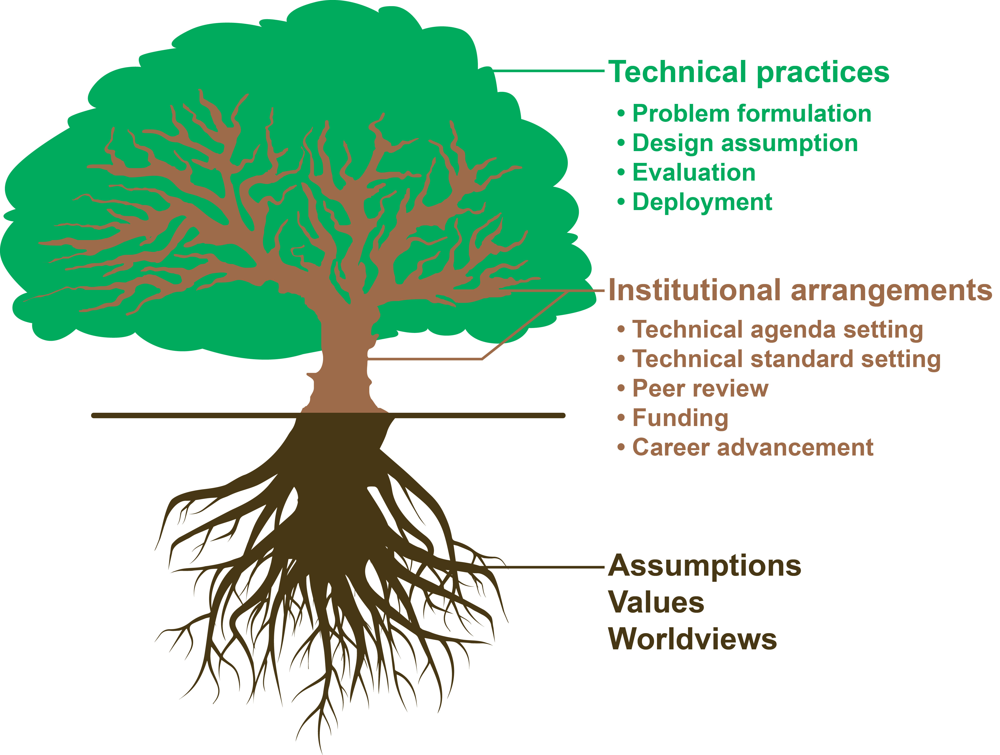

# Examples of Critical Technical Practice
{:.no_toc}

This is a growing list of examples to show the conduct of critical technical practice in various domains, techinques, and aspects.

We categorize these works by their location in the sociotechnical system, as shown by the tree illustration.

## Table of contents
{: .no_toc .text-delta }

1. TOC
{:toc}

---

# Critically examine the assumptions, values, and worldviews in technical practices

- [Toward a Critical Technical Practice](https://pages.gseis.ucla.edu/faculty/agre/critical.html). Phil Agre. 1997
- [The Values Encoded in Machine Learning Research](https://dl.acm.org/doi/10.1145/3531146.3533083). Abeba Birhane, et al. 2022.  
- [Making Power Explicable in AI: Analyzing, Understanding, and Redirecting Power to Operationalize Ethics in AI Technical Practice](https://arxiv.org/abs/2510.10588). Weina Jin, et al. 2025.  
- [The TESCREAL bundle: Eugenics and the promise of utopia through artificial general intelligence](https://firstmonday.org/ojs/index.php/fm/article/view/13636). Timnit Gebru, Émile P. Torres. 2024.
- [Fairness and Abstraction in Sociotechnical Systems](https://dl.acm.org/doi/10.1145/3287560.3287598). Andrew D. Selbst, et al. 2019.
- [A sociotechnical view of algorithmic fairness](https://arxiv.org/abs/2110.09253). Mateusz Dolata, et al. 2021.
- [Stop treating \`AGI' as the north-star goal of AI research](https://arxiv.org/abs/2502.03689). Borhane Blili-Hamelin, et al. 2025.  
- [Large Models of What? Mistaking Engineering Achievements for Human Linguistic Agency](https://www.sciencedirect.com/science/article/pii/S0388000124000615). Abeba Birhane, Marek McGann. 2024.
- [The Impossibility of Automating Ambiguity](https://ieeexplore.ieee.org/abstract/document/10302088). Abeba Birhane, et al. 2021.  

# Critically examine the institutional arragements and paradigms in technical practices

- [Confronting Power and Corporate Capture at the FAccT Conference](https://dl.acm.org/doi/abs/10.1145/3531146.3533194). Young, et al. 2022.
- [Design Practices: ‘Nothing About Us Without Us’](https://academic.oup.com/book/55103/chapter/423911606). Sasha Costanza-Chock. 2023  
- [Machine Learning that Matters](https://arxiv.org/abs/1206.4656). Kiri Wagstaff. 2012.  
- [Machine learning for science and society](https://link.springer.com/article/10.1007/s10994-013-5425-9). Cynthia Rudin & Kiri L. Wagstaff. 2013.
- [Computer-vision research powers surveillance technology](https://www.nature.com/articles/s41586-025-08972-6). Pratyusha Ria Kalluri, et al. 2025.  
- [The reanimation of pseudoscience in machine learning and its ethical repercussions](https://www.sciencedirect.com/science/article/pii/S2666389924001600). Mel Andrews, et al. 2024.  

# Critically examine the technical conventions, standards, and common practices

- [Why is plausibility surprisingly problematic as an XAI criterion?](https://arxiv.org/abs/2303.17707) Weina Jin, et al. 2025.  
- [Leakage and the reproducibility crisis in machine-learning-based science](https://www.sciencedirect.com/science/article/pii/S2666389923001599). Sayash Kapoor, Arvind Narayanan. 2023.
- [Why We Must Rethink Empirical Research in Machine Learning](https://arxiv.org/abs/2405.02200). Moritz Herrmann, et al. 2024

# Identify and understand the limitations and weaknesses of techniques

- [On the Dangers of Stochastic Parrots: Can Language Models Be Too Big?](https://dl.acm.org/doi/10.1145/3442188.3445922) Emily M. Bender, et al. 2021.

# Construct alternative technical practice

- [AI for Just Work: Constructing Diverse Imaginations of AI beyond "Replacing Humans"](https://arxiv.org/abs/2503.08720). Weina Jin, et al. 2025.
- [Ethical Medical Image Synthesis](https://arxiv.org/abs/2508.09293). Weina Jin, et al. 2025.

